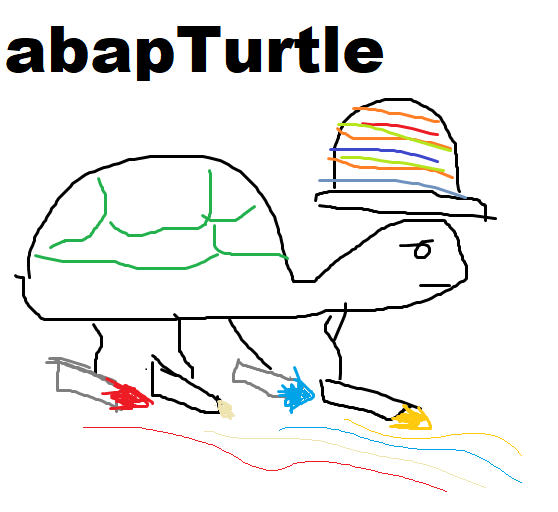

Enterprise-grade turtle graphics library for abap intended for business-oriented children or bored adults. 

The graphics are generated in the svg format. 

## Usage example

### Turtle

```abap
REPORT zabapturtle.

DATA(turtle) = NEW zcl_turtle( height = 800 width = 800 ).

turtle->set_pen( VALUE #(
        fill_color = `#FF0000`
        stroke_color = `#FF00FF`
        stroke_width = 2 ) ).

turtle->goto( x = 200 y = 200 ).
DATA(i) = 0.
DATA(n) = 15.
WHILE i < n.
  turtle->polygon( num_sides = 10 side_length = 50 ).
  turtle->right( 360 / n ).

  i += 1.
ENDWHILE.

turtle->show( ).
```


see `zcl_turtle_examples` for more

#### Supported instructions

movement:

- forward, back
- left,right (rotate by x degrees)

svg primitives:

- line
- circle
- polyline
- polygon
- text

styling:

- stroke width
- stroke color
- fill color

Color schemes:
A random color is used for each line. You can use `turtle->set_color_scheme( )` to change the colors.


### L-systems (or TurtleScript, if you will)

[Wiki link](https://en.wikipedia.org/wiki/L-system)

Define an initial state, a number of iterations and a set of replacement rules. These will be applied in each iteration. Finally, the symbols are translated into instructions and executed.

#### Supported symbols:

- `F`, `G`, `H` - variables. Interpreted as forward()
- `+`, `-` - rotate right/left
- `[` - push current position on a stack
- `]` - pop and goto popped position from the stack

```abap
    DATA(turtle) = zcl_turtle=>new( height = 800 width = 600 ).
    turtle->goto( x = 200 y = 200 ).
    
    DATA(parameters) = VALUE zcl_turtle_lsystem=>params(
      initial_state = `F`
      move_distance = 10
      rotate_by = 90
      num_iterations = 3
      rewrite_rules = VALUE #(
        ( from = `F` to = `F+F-F-F+F` )
       )
    ).

    DATA(lsystem) = zcl_turtle_lsystem=>new(
      turtle = turtle
      parameters = parameters ).

    lsystem->execute( ).
    lsystem->show( ).
```


The stack can be used to generate plants or trees:
```abap
DATA(turtle) = zcl_turtle=>new( height = 800 width = 600 ).
    turtle->goto( x = 300 y = 600 ).
    turtle->set_angle( -90 ).

    DATA(parameters) = VALUE zcl_turtle_lsystem=>params(
      initial_state = `F`
      move_distance = 10
      rotate_by = 25
      num_iterations = 5
      rewrite_rules = VALUE #(
        ( from = `F` to = `F[+F]F[-F][F]` )
       )
    ).

    DATA(lsystem) = zcl_turtle_lsystem=>new(
      turtle = turtle
      parameters = parameters ).

    lsystem->execute( ).
    lsystem->show( ).
```


